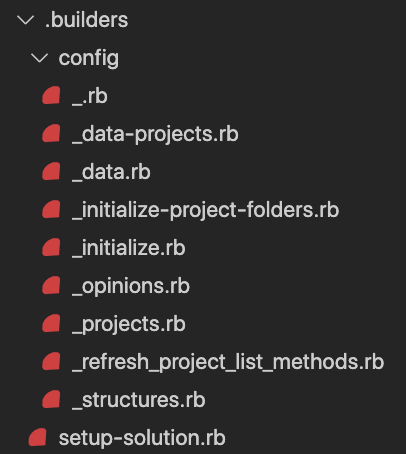
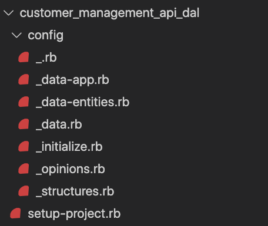
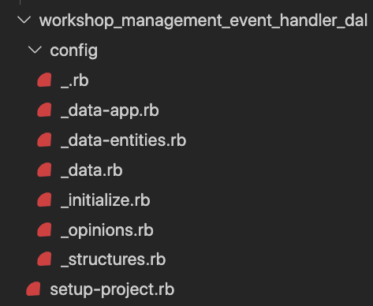

# New.rb

`new.rb` is a simple watched file for the creation of new .builder configuration sets.

## New examples

```ruby
# Create a new solution that contains many projects to solve a business problem.

# Example:
solution = builder.new_solution(:pitstop)
```



```ruby
# Create two projects attached to the solution

# Example:
builder
  .current_solution(solution)
  .new_project_library(:customer_management_api_dal, 
                       name: 'CustomerManagement.Api.Dal',
                       variant: :entity_framework)
  .new_project_library(:customer_management_api_dal, 
                       name: 'WorkshopManagement.EventHandler.Dal',
                       variant: :entity_framework)
```
<table>
<tr>
<td>



</td>
<td>



</td>
</tr>
</table>
